## 计算机毕业设计hadoop+spark+hive物流预测系统 物流大数据分析平台 物流信息爬虫 物流大数据 机器学习 深度学习(源码+LW+PPT+讲解)


## 要求
### 源码有偿！一套(论文 PPT 源码+sql脚本+教程)

### 
### 加好友前帮忙start一下，并备注全新物流26
### 我的QQ号是 1679232425 或者798059319或者2827724252 或者微信:biyesheji1698 或者 bysj2023nb

# 

### 加qq好友说明（被部分 网友整得心力交瘁）：
    1.加好友务必按照格式备注
    2.避免浪费各自的时间！
    3.当“客服”不容易，repo 主是体面人，不爆粗，性格好，文明人。
## 介绍描述


```
1.Python爬虫采集物流数据等存入mysql和.csv文件；
2.使用pandas+numpy或者MapReduce对上面的数据集进行数据清洗生成最终上传到hdfs；
3.使用hive数据仓库完成建库建表导入.csv数据集；
4.使用hive之hive_sql进行离线计算，使用spark之scala进行实时计算；
5.将计算指标使用sqoop工具导入mysql；
6.使用Flask+echarts进行可视化大屏实现、数据查询表格实现、多种分析统计图、含预测算法炫酷显摆；

```


## 运行视频
https://www.bilibili.com/video/BV1azBKBeE3L

## 运行截图
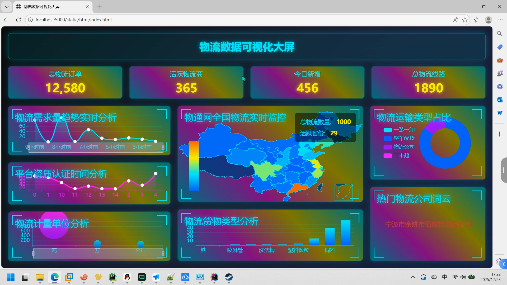
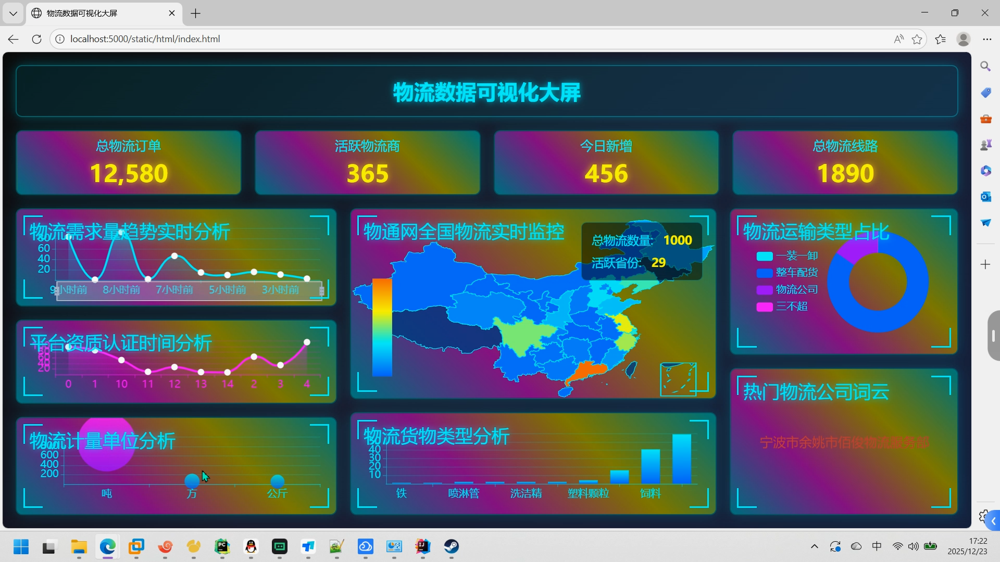
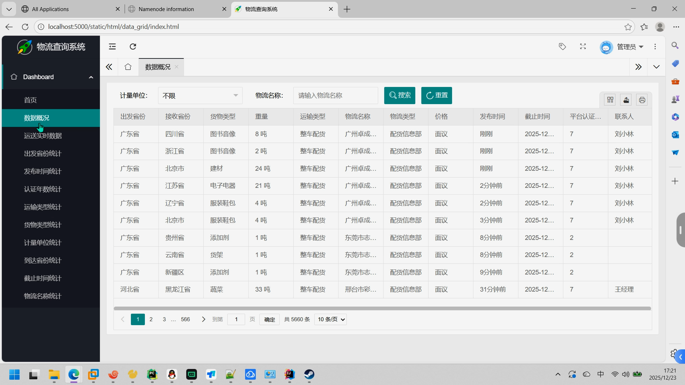
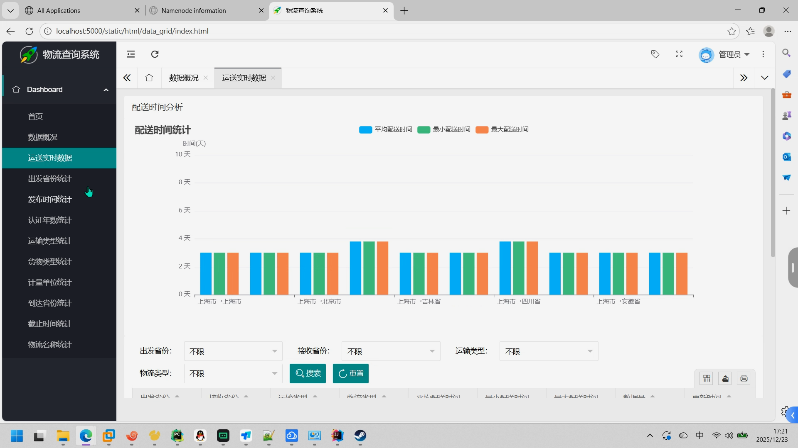
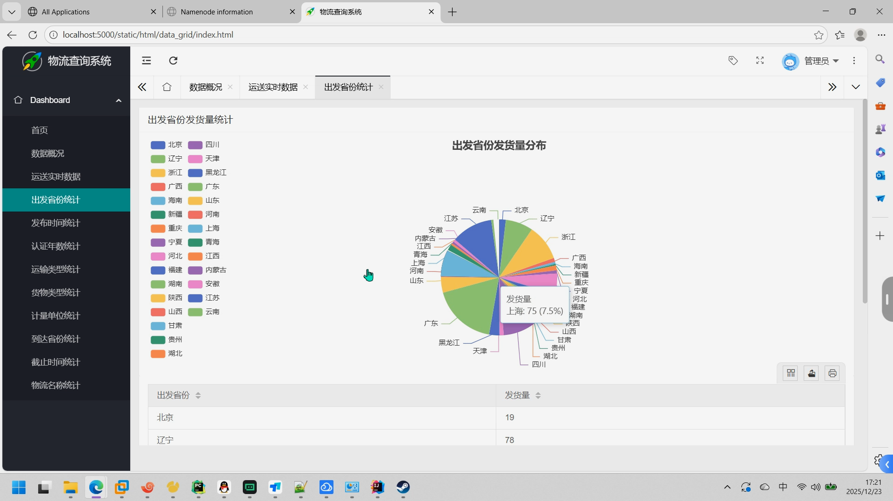
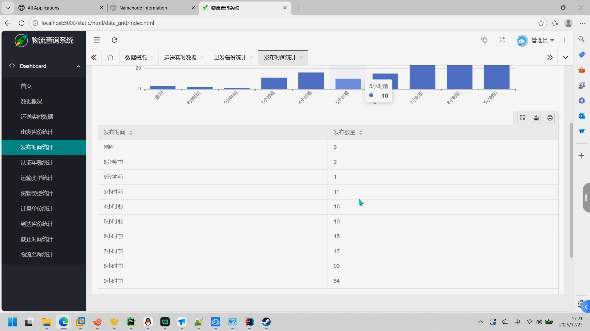
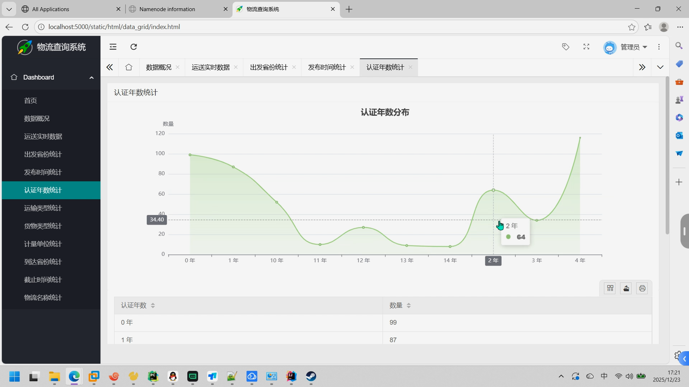
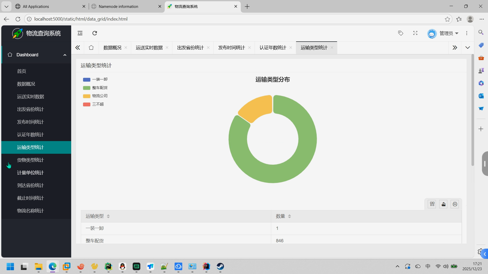
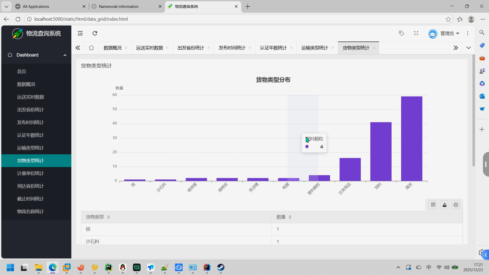
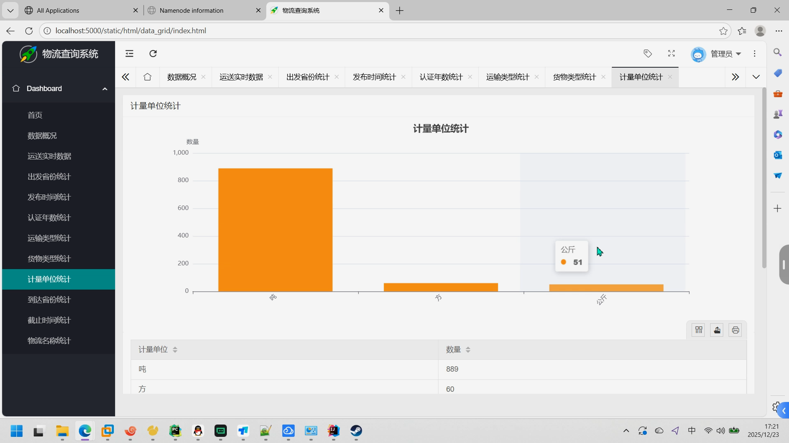
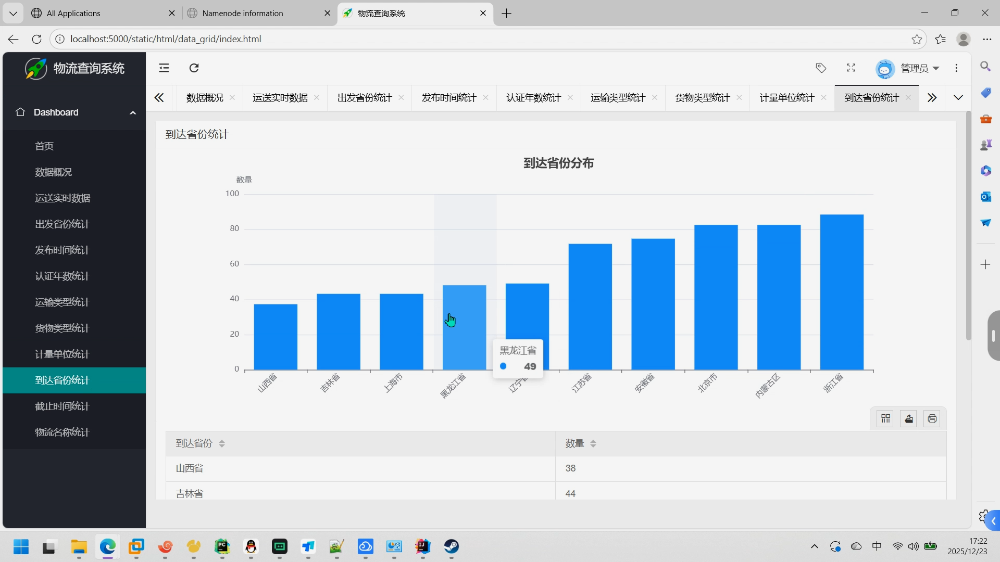

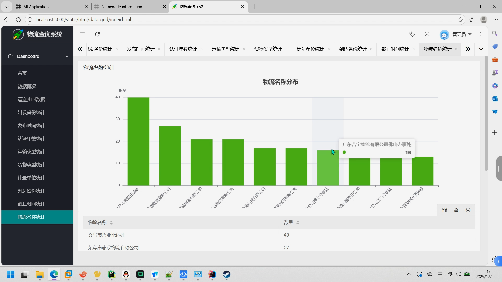


